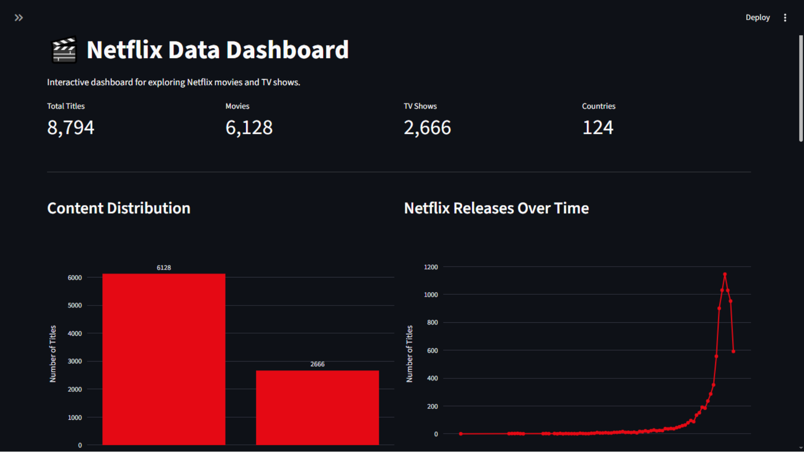
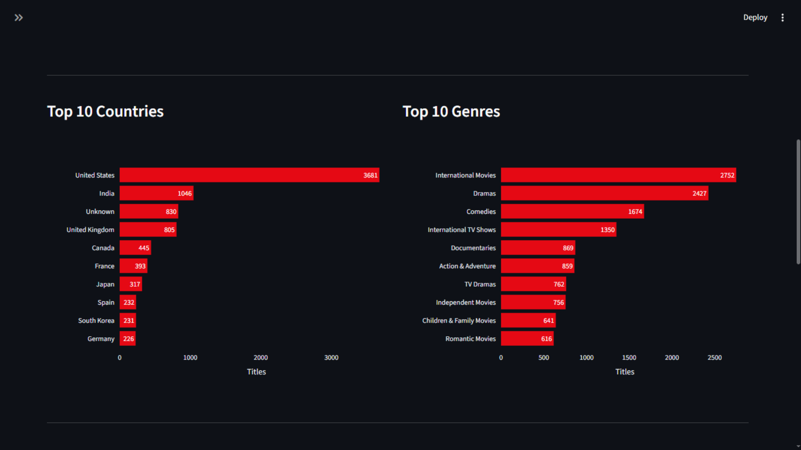
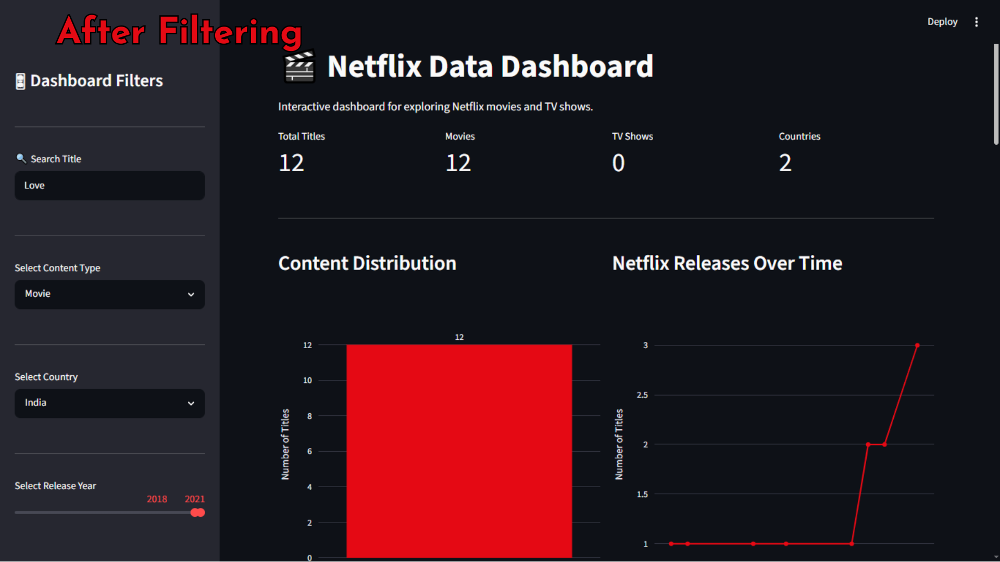
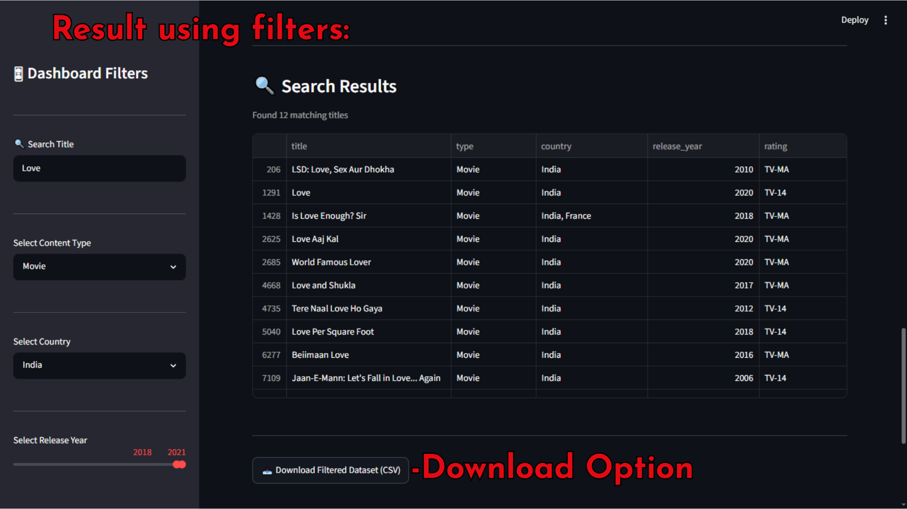

# Netflix Data Dashboard

An interactive analytics dashboard exploring Netflix's global content catalog — built with Python, Pandas, and Plotly, deployed via Streamlit.

**Live app:** https://netflix--data--dashboard.streamlit.app

**Repo:** https://github.com/Tarun-Bagga/Netflix-Data-Dashboard

## What it does

Analyzes **8,800+ Netflix titles across 190+ countries**, letting users filter by content type, country, release year, and rating, search titles instantly, and export the filtered results as CSV.

## Preview

**Home Dashboard**


**Additional Charts**


**Interactive Filters**


**Search & Download**


## Visualizations included

- Content type distribution (Movies vs TV Shows)
- Netflix releases over time
- Top 10 countries by content volume
- Top 10 genres
- Content rating distribution
- Movie runtime distribution

## Features

- Interactive KPI cards
- Content type / country / release year / rating filters
- Instant title search
- Interactive Plotly charts
- Filtered dataset download (CSV)
- Responsive layout

## Tech stack

| Technology | Purpose |
|------------|---------|
| Python | Core language |
| Pandas | Data cleaning & analysis |
| Plotly Express | Interactive visualizations |
| Streamlit | Dashboard framework |

## Project structure

```text
Netflix-Data-Dashboard/
├── app.py
├── analysis.py
├── requirements.txt
├── README.md
├── .gitignore
├── data/
│   └── netflix_titles.csv
├── images/
│   └── charts/
└── screenshots/
    ├── 01_dashboard_home.png
    ├── 02_dashboard_other_charts.png
    ├── 03_dashboard_filters.png
    └── 04_dashboard_search_&_download.png
```

## Installation

```bash
git clone https://github.com/Tarun-Bagga/Netflix-Data-Dashboard.git
cd Netflix-Data-Dashboard
pip install -r requirements.txt
streamlit run app.py
```

## Dataset

Netflix Movies and TV Shows dataset — title, type, director, cast, country, release year, rating, duration, and genre for each entry.

## What this demonstrates

- Data cleaning and transformation on a real, messy public dataset
- Exploratory data analysis and multi-dimensional filtering logic
- Interactive dashboard design and deployment

## Limitations

- Pure exploratory tool — no predictive or recommendation component, by design.
- Dataset is a static snapshot; doesn't reflect Netflix's current catalog in real time.

## Future improvements

- Director/cast-level analytics
- Content recommendation system
- World map visualization by country
- Advanced search and sorting

## Author

**Tarun Bagga** — [GitHub](https://github.com/Tarun-Bagga)
